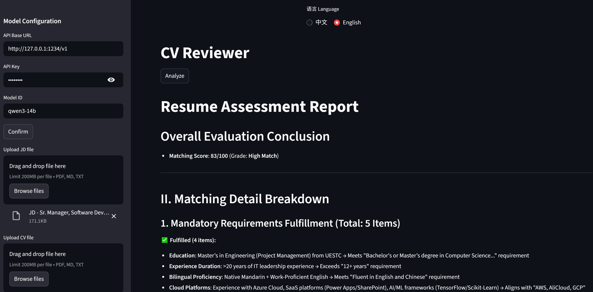

# CV Reviewer 简历评审应用
[[English]](Readme.md) 


## 简介
- 基于 Streamlit 与 Agno 框架的简历评审工具。
- 支持中文/英文界面与输出切换（默认中文）。
- 侧边栏提供模型配置（兼容 OpenAI API 的 `Base URL`、`API Key`、`模型ID`）。
- 上传 JD 与简历（PDF/MD/TXT），点击“分析”生成 Markdown 报告，包含评分与建议。

## 环境要求
- Python 3.10 及以上版本（建议）
- 可用的、兼容 OpenAI API 的推理服务（如本地或云端）

## 安装依赖
```bash
pip install -r requirement.txt
```

## 运行
```bash
streamlit run app.py
```

## 使用步骤
- 顶部中间选择语言（默认中文）。
- 在侧边栏填写：`API Base URL`、`API Key`、`模型ID`，点击“确认”。
- 在侧边栏上传 JD 文件与简历文件（支持 `pdf`、`md`、`txt`）。
- 在主内容区点击“分析”，稍候即可在页面看到评分与 Markdown 报告。

## 功能说明
- 语言切换：界面与输出语言联动，中文/英文均可。
- 模型配置：三项均为必填；确认后会重建 Agent 并提示“已完成，可以进行下一步”。
- 文件支持：`pdf` 自动转换为 Markdown；`md`/`txt` 直接读取为文本。
- 输出内容：包含匹配度、亮点、风险与改进建议，并给出 0–100 评分（根据系统提示）。

## 目录结构
- `app.py`：主应用入口与 UI 逻辑
- `requirement.txt`：依赖列表
- `sys_prompt.md`：系统提示词（指令）

## 常见问题
- 无法连接模型服务：检查侧边栏的 `API Base URL` 是否正确，以及服务是否已启动。
- 文件类型不支持：请将 JD/简历转换为 `pdf`、`md` 或 `txt`。
- 输出语言不一致：确认顶部语言选择，与侧边栏已点击“确认”。

